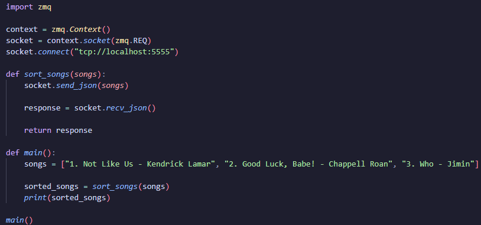

# CS361-Microservice
How to REQUEST data from the microservice:

1. Install and import ZeroMQ
2. Prepare the context and socket
3. Send a request to the microservice

How to RECEIVE data from the microservice:

1. Install and import ZeroMQ
2. Prepare the context and socket
3. Use recv_json to get a JSON response from the microservice

